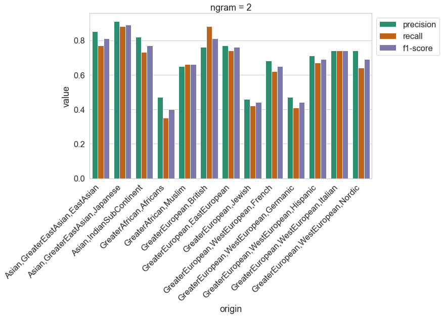

# Name origin classification
A basic bidirectional LSTM model for name origin classification based on NGrams

## Data
The data were originally collected by a team lead by Steven Skiena as part of the project to build a classifier for race and ethnicity based on names. The team scraped Wikipedia to produce a novel database of over 140k name/race associations. For details of the how the data was collected, see Name-ethnicity classification from open sources (for reference, see below).

if you use the data, please cite the following paper:

```
@inproceedings{ambekar2009name, title={Name-ethnicity classification from open sources}, author={Ambekar, Anurag and Ward, Charles and Mohammed, Jahangir and Male, Swapna and Skiena, Steven}, booktitle={Proceedings of the 15th ACM SIGKDD international conference on Knowledge Discovery and Data Mining}, pages={49--58}, year={2009}, organization={ACM} }
```

Ethnicity labels:
```
0	Asian,GreaterEastAsian,EastAsian
1	Asian,GreaterEastAsian,Japanese
2	Asian,IndianSubContinent
3	GreaterAfrican,Africans
4	GreaterAfrican,Muslim
5	GreaterEuropean,British
6	GreaterEuropean,EastEuropean
7	GreaterEuropean,Jewish
8	GreaterEuropean,WestEuropean,French
9	GreaterEuropean,WestEuropean,Germanic
10	GreaterEuropean,WestEuropean,Hispanic
11	GreaterEuropean,WestEuropean,Italian
12	GreaterEuropean,WestEuropean,Nordic
```

### Data preprocessing
The processing follows the following steps:
1. Merge middle names and first names into one column
2. Merge fisrt and last names into one column in order to have a single string for each name. e.g. "John" "Smith" becomes "John Smith"
3. For a fixed N (e.g. 2), create a list of all N-grams for each name. e.g. "John Smith" becomes ["Jo", "oh", "hn", "n ", " S", "Sm", "mi", "it", "th", "h"]
4. For each N-gram, count the number of occurences in the dataset. e.g. "Jo" appears 100 times in the dataset and create a dictionary with the N-grams as keys and the counts as values.

## Model
The model is a bidirectional LSTM with 1 layer. The input is a sequence of N-grams and the output is a probability distribution over the 13 classes. The model is trained using the Adam optimizer and the categorical cross-entropy loss function.

Example of a bigram model:
<p align="center">
  
</p>

## Results
We train the models for a few epochs, mostly for the purpose of testing the learning strategy and avoiding overfitting. The results are not very good, but training for more epochs or with a larger dataset might improve the results.

### Bigrams 
Results on the test set for a bigram model (N=2) are shown below. 

**Accuracy**: 0.72 



### Character-level model
Results on the test set for a character-level model (N=1) are shown below.

**Accuracy**: 0.72

